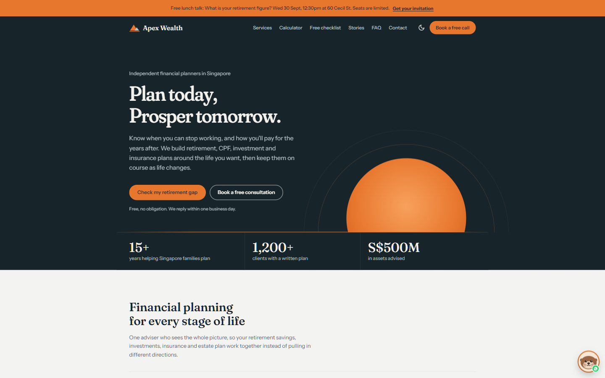

# Apex Wealth Planning

*Plan today, Prosper tomorrow.* A one-page lead-generation site for a Singapore financial-planning firm offering retirement, investment and insurance planning.



**Live site:** https://akigixon.github.io/horizon-wealth-planning/

## Features

- **Lead generation**: a drag-slider retirement calculator that shows the earliest age you could retire and your savings gap (CPF LIFE from 65, runs entirely in the browser), a gated *Singapore Retirement Readiness Checklist* with an instant thank-you page, a once-per-visit slide-in offer, a timed lunch-talk invitation popup (with an announcement bar, auto-expiring after the event), a floating otter chat widget that connects visitors to WhatsApp, a consultation enquiry form and a newsletter sign-up
- **SEO**: keyword-targeted title and headings, canonical URL, Open Graph/Twitter cards, `FinancialService` + `FAQPage` + `WebSite` structured data, an FAQ section and `sitemap.xml`
- **Design**: copper-orange and slate theme with light and dark modes (follows the OS by default, with a toggle that remembers your choice)
- **Security hardening**: strict Content-Security-Policy with no inline scripts, anti-clickjacking, XSS-safe rendering of user input, honeypot and timing checks against form spam, SHA-pinned GitHub Actions with Dependabot, and a deploy step that publishes an explicit allow-list of files
- **Accessibility**: skip link, visible focus, WCAG AA contrast in both themes, `prefers-reduced-motion` support, screen-reader text for animated numbers, and content that stays visible if JavaScript fails

## Tech

Plain HTML, CSS and vanilla JavaScript with no frameworks, build tools or package manager. CSS and JS live in `assets/` (not inline) so the Content-Security-Policy can block injected scripts. The only external resources are Google Fonts (Fraunces and Instrument Sans) and randomuser.me avatars.

## Run locally

```bash
python -m http.server 8000
```

Then open http://localhost:8000. There is no build step.

## Deployment

`.github/workflows/deploy-pages.yml` deploys the site to GitHub Pages on every push to `main`. The workflow only publishes the files listed in its **Prepare site files** step, so add any new file there.

## Before going live with real leads

Form submissions are simulated (they are logged to the browser console). To capture real leads:

1. Connect the forms to a form or email service (e.g. your CRM, Formspree, or a serverless function) and deliver the checklist by email.
2. Add that service's origin to the Content-Security-Policy (`connect-src` and/or `form-action`) in `index.html`.
3. Add server-side validation, rate limiting and a CAPTCHA; the client-side spam checks are only a first layer.
4. Publish a privacy policy (PDPA) and link it from the forms.
5. If you use a custom domain, update the canonical, Open Graph and JSON-LD URLs and `sitemap.xml`, then submit the sitemap in Google Search Console. A host that supports response headers (e.g. Cloudflare Pages or Netlify) would also let you send CSP, `frame-ancestors` and HSTS as real headers.

## Disclaimer

This is a demo site. The company, address, office phone number, email, statistics and testimonials are placeholders (the WhatsApp number in the chat widget is real), and nothing on the site is financial advice.
